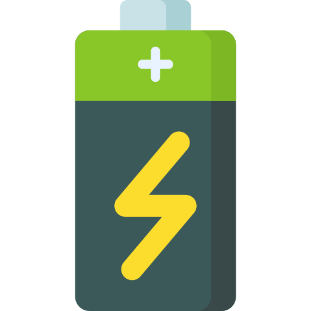
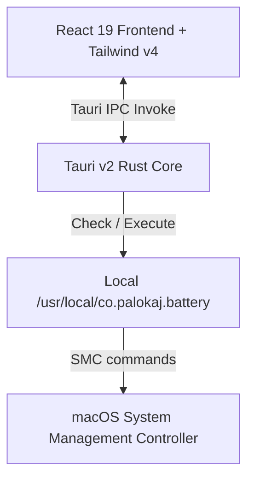

<div align="center">
  
  
  # Battery Control
  
  ### A beautiful, lightweight macOS Menu Bar utility to manage charging limits and preserve battery health.
  
  [](https://apple.com)
  [](https://tauri.app)
  [](https://react.dev)
  [](https://www.rust-lang.org)

  <p align="center">
    <a href="#features">Key Features</a> •
    <a href="#architecture">Architecture</a> •
    <a href="#how-it-works">How It Works</a> •
    <a href="#installation--setup">Installation & Setup</a> •
    <a href="#development">Development</a> •
    <a href="#troubleshooting">Troubleshooting</a>
  </p>
</div>

---

## Overview

**Battery Control** is a macOS status bar (accessory) utility that empowers MacBook users to control their battery's charging behavior. By restricting maximum charge levels (e.g., maintaining at 80%) and forcing discharge on-demand, the app helps minimize battery degradation caused by high-voltage states, especially for laptops that remain permanently plugged into desktop monitors.


---

## Features

- 🔋 **Custom Charge Limit Slider**: Set a custom charging threshold anywhere between **50% and 100%**.
- ⚡ **Forced Discharge**: Force the MacBook to run on battery power even while connected to a power supply.
- 🚀 **Top Up on Demand**: Easily override the limits temporarily to charge to 100% before travel.
- 🖥️ **Menu Bar Integration**: Operates as a native macOS accessory window that slides directly under the menu bar icon when clicked and hides immediately when focus is lost.
- 🛠️ **Seamless Helper Installation**: Automatically configures the background SMC binary and permissions helper in a single click using secure privilege elevation.
- 📉 **Real-Time Status Monitoring**: Displays live charging statuses, remaining time-to-empty, and targets with automatic polling.

---

## Architecture

The project relies on a hybrid stack combining a high-performance native Rust core with a modern, smooth web frontend:



### 1. Frontend (`src/`)
- **React 19 & TypeScript**: Provides state management for limits, status flags, dragging gestures, and interval-based polling.
- **Tailwind CSS v4**: Powers a dark, glassy, modern visual interface complete with custom glow-effects, dynamic battery percentage indicators, and smooth animations.
- **Tray-Adaptive Layout**: Configured for 400x100 window sizes, responding directly to the bounds of the macOS status item.

### 2. Backend (`src-tauri/`)
- **App Setup (`src-tauri/src/lib.rs`)**:
  - Sets the application's activation policy to `Accessory` (hiding it from the Dock and Cmd+Tab switcher).
  - Listens to left-click events on the Tray Icon, calculates the absolute coordinate offsets dynamically, and positions the app window right below the menu bar icon.
  - Automatically hides the window when focus is lost.
- **Command Layer (`src-tauri/src/battery.rs`)**:
  - Exposes Tauri commands for checking installation, copying CLI resources, reading states, and executing battery thresholds.
  - Uses `std::process::Command` to trigger the underlying SMC wrapper.

### 3. CLI Helper Core (`src-tauri/resources/`)
The application bundles two compiled binary resources:
1. `battery.sh`: The open-source `battery` CLI utility (originally by [@actuallymentor](https://github.com/actuallymentor/battery)).
2. `smc`: Intel and Apple Silicon compatible System Management Controller tool.

---

## How It Works

### SMC Key Modifications
The application controls charging by interfacing directly with the macOS System Management Controller (SMC) using passwordless execution rule-sets:

| Command / Action | SMC Command (Key & Values) | Description |
| :--- | :--- | :--- |
| **Charging Off** | `smc -k CH0B -w 02`, `smc -k CH0C -w 02`, `smc -k CHTE -w 01000000` | Suspends charging from the power source |
| **Charging On** | `smc -k CH0B -w 00`, `smc -k CH0C -w 00`, `smc -k CHTE -w 00000000` | Re-enables standard battery charging |
| **Force Discharge On** | `smc -k CH0I -w 01`, `smc -k CHIE -w 08`, `smc -k CH0J -w 01` | Draws power from the battery even while plugged in |
| **Force Discharge Off** | `smc -k CH0I -w 00`, `smc -k CHIE -w 00`, `smc -k CH0J -w 00` | Normal power delivery behavior |
| **Magsafe LED Control** | `smc -k ACLC -w <00-04>` | Optional control over status indicators |

### Passwordless Privilege Escalation (`visudo`)
Because writing to the SMC requires root privileges, the application creates a dedicated configuration file at `/private/etc/sudoers.d/battery` on the first run. The script asks for administrator permissions once to write the following `NOPASSWD` rules:
```text
ALL ALL = NOPASSWD: /usr/local/co.palokaj.battery/battery update_silent
ALL ALL = NOPASSWD: /usr/local/co.palokaj.battery/battery update_silent is_enabled
ALL ALL = NOPASSWD: CHARGING_OFF
ALL ALL = NOPASSWD: CHARGING_ON
ALL ALL = NOPASSWD: FORCE_DISCHARGE_OFF
ALL ALL = NOPASSWD: FORCE_DISCHARGE_ON
```
This enables the Tauri GUI wrapper to seamlessly change your battery limit or force discharge instantaneously without prompting for sudo passwords.

---

## Installation & Setup

### Prerequisites
To build or run this application locally, you will need:
1. **macOS**: An Apple Silicon (M1/M2/M3/M4) or Intel-based MacBook.
2. **Xcode Command Line Tools**: Install by running:
   ```bash
   xcode-select --install
   ```
3. **Rust & Cargo**: Install via [rustup](https://rustup.rs/):
   ```bash
   curl --proto '=https' --tlsv1.2 -sSf https://sh.rustup.rs | sh
   ```
4. **Node.js & npm**: Download and install from [nodejs.org](https://nodejs.org/).

---

## Development

1. **Clone the Repository**:
   ```bash
   git clone <repository-url>
   cd battery-control
   ```

2. **Install Dependencies**:
   ```bash
   npm install
   ```

3. **Run the App in Development Mode**:
   ```bash
   npm run tauri dev
   ```
   This compiles the Rust backend, starts the Vite frontend dev server, and opens the tray-accessory window.

4. **Build the Production Bundle**:
   ```bash
   npm run tauri build
   ```
   The compiled `.app` package will be generated inside the `src-tauri/target/release/bundle/macos/` directory.

---

## Troubleshooting

### Helper tool installation fails
If the app fails to initialize the helper on the first screen, check that your account has administrator privileges. You can also inspect the output by running:
```bash
ls -l /usr/local/co.palokaj.battery/
```
Ensure that `battery` and `smc` are present and owned by `root:wheel` with permission bits set to `755`.

### Reverting to Default macOS Charging Behavior
If you ever want to uninstall the utility or reset charging configuration to normal (100% capacity threshold):
1. Click the Menu Bar icon.
2. Right-click the icon or click the context menu dropdown in the top-right.
3. Select **Reset to Normal**.
4. To fully clean up the binary files:
   ```bash
   sudo rm -rf /usr/local/co.palokaj.battery
   sudo rm -f /private/etc/sudoers.d/battery
   sudo rm -f /usr/local/bin/battery
   ```

---

## License

This project is licensed under the MIT License. See [LICENSE](LICENSE) for details. Special thanks to [@actuallymentor](https://github.com/actuallymentor) for the initial CLI implementation.

